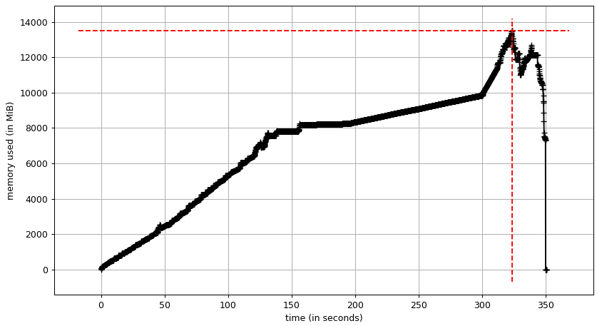
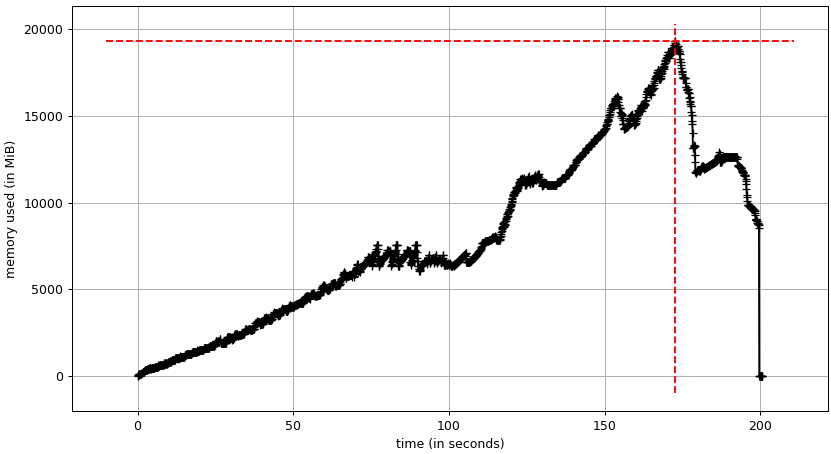
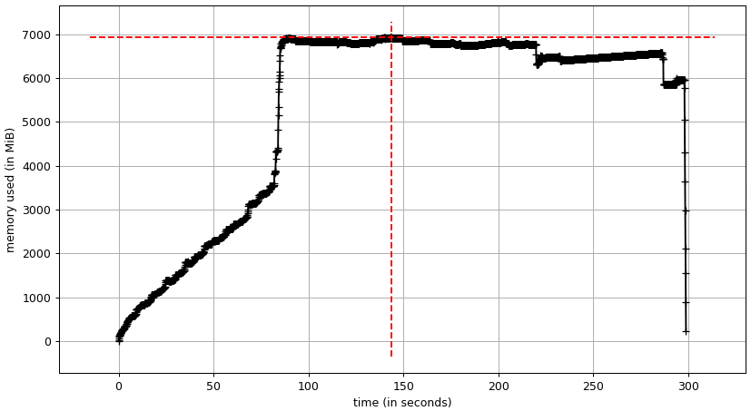
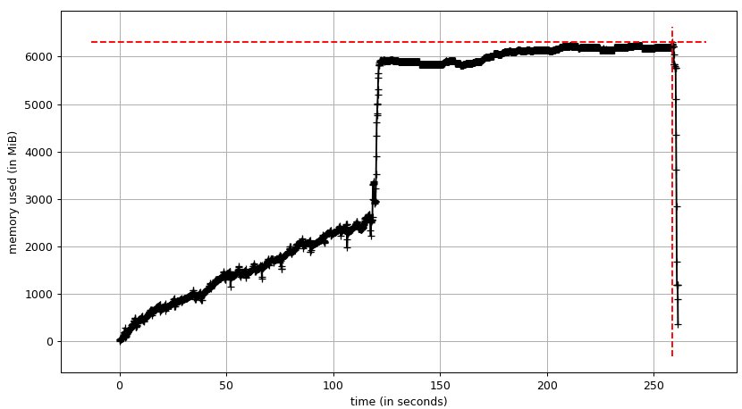

GIS can change with current technology as Apache Arrow, and perhaps, also with some different techniques.
In Pythonland Geopandas enhanced performance over time. In addition, I also wanted to try Dask, DuckDB and Apache Sedona.

Please contact me, when you read this and think I could have increased the code quality and speed.
I use some public data, which still widely use shape files in Germany.

# The Data

First I loaded fhe ALKIS (register) building data for [all counties in the state of Brandenburg](https://data.geobasis-bb.de/geobasis/daten/alkis/Vektordaten/shape/).
All vector files are open data. The vector files are still offered as Shapefiles.
From the ALKIS Dataset of Brandenburg I used the buildings and the parcels (with land usage).
The files are stored per county!
The geometries have some errors which Geopandas auto-detects and fixes.
In addition, some file can not be opened with the [fiona](https://fiona.readthedocs.io/en/latest/index.html) library from Geopandas, with the error message
of multiple  geometry columns. Hence, we always use de new default: pyogrio.

# Task

1) Open the datasets and concat the counties.
2) Create an overlay with intersection
3) Save the data se, when possible as geoparquet file.

Why did select this task?
I consider the overlay is one of the more compute heavy tasks in GIS. Perhaps I will write posts about other tasks later.
In [Geopandas](https://github.com/geopandas/geopandas/blob/main/geopandas/tools/overlay.py)
this uses a spatial index, then computes an intersection and joins the original data to the intersection. 

We close the saving as Geoparquet file, as it's the only format Dask-GeoPandas can write to.
In addition, the result (with snappy compression) is small 391 MB, compared to what Geopackage (1.57 GB) needs.

By the way, I select which columns to open in Geopandas, because later I will find out, that one column does only contain `None`'s.
Hence, I just don't use not important columns form the start.

# The Hardware

I run the speed test on a WIN10 PV with a Ryzen 7 5800X with 48 GB of RAM. 
The final runs are done with hyperfine and 3 warmup runs and the default 10 runs, 5 for DuckDB[^1].

[^1]: While using Hyperfine on the DuckDB code, I found out that a file for each output is created in the Temp folder. 
These files have in uuid part and are never deleted. Hence, they wrote to disk until the main drive is full and stops
the test.

The memory usage tests are done on a Laptop with Ryzen 7 4800 and 32 GB of RAM with TuxedoOS.
The reason is that the RAM usage is only meaning fully recorded on Linux.

# The Frameworks

## [Geopandas](https://geopandas.org/en/stable/index.html)

For me Geopandas is the goto solution for year now.
Sometimes with some extra code, some extra libs as pyogrio.

*Expectations*: Well, nothing special. It just works. Should load the data faster with [pyogrio](https://pyogrio.readthedocs.io/en/latest/).

*Observations*: Initially, loading the datasets takes about 75 to 80 s on my machine with am AMD Ryzen 5800X CPU.
Duration between different runs does vary slightly.It's somewhat faster when using arrow by about 15 s.
 It got a bit slower, wehen dropping the duplicates (on the county borders) by there `oid`. 

In the end I also tried to load and build the intersection per county and then just concat the results.
It's not faster, due to the spatial indexing.? RAM usage is initially much lower with about 3 GB.

With the reduced number of columns the durations are:

| Task           | Geopandas \s | Geopandas & arrow \s | Geopandas & pyogrio, per county \s |
|:---------------|-------------:|---------------------:|-----------------------------------:|
| Loading Shape  |           74 |                   59 |                                    |
| Intersection   |          204 |                  181 |                                    |
| Saving Parquet |           11 |                   11 |                                 12 |
| Overall        |          290 |                  251 |                                264 |

We save 3.620.994 polygons.

## [Dask-Geopandas](https://dask-geopandas.readthedocs.io/en/stable/)

*Expectations*: Partitioning the DataFrame should increase the number of used cores. Hence, reduce the compute time.

*Observations*: I open the shapefiles just as before with geopandas, but then convert to a Dask-Geopandas GeoDataFrames.
This all increases the loading time somewhat From about 60s to 76 s. It's not much because I do not create the spartial
partioning!

Finally, I try the map_partitions method. Left on a Dask-GeoDataFrame (the larger parcels dataset) and on the right
hand side the smaller houses GeoDataFrame. Having the larger dataset as Dask-GeoDataFrame increases the speed.
No, spatial swapping need as a spatial index is already used.
For the map_partitions I create function that wraps the overlay. This created a single duplicate.

| Task           | Geopandas \s | Dask-Geopandas \s |
|:---------------|-------------:|------------------:|
| Loading Shape  |           59 |                76 |
| Intersection   |          181 |                62 |
| Saving Parquet |           11 |                12 |
| Overall        |          251 |               151 |

This really uses all cores and a usage between 30 % and 95 % can be seen while the Overlay
is processed. This reduces the computation time to 33 % on this machine.

But three times faster, for 8 cores and 16 threads on the machine. Is not fully, what I expected.

## [DuckDB](https://duckdb.org/docs/extensions/spatial/overview)

DuckDB has a spatial extension. Although the csv/parquet file readers works great the
 asterix placeholder to load several file at once. 
But it is not possible with ST_Read for reading spatial data. Hence, I use pathlib like with the other frameworks.
Also, geoparquet is not supported for writing. Therefore, I selected `FlatGeobuf`, as Geopackage could not be saved.
There is no overlay I have to do all the steps by myself. So, there is a possibility that my solution is suboptimal.

Also writing the data does add a coordinate system. Nevertheless, the data can be opened with QGIS.
Due to the usage of FlatGeoBuf, file size and writing times are worse, than for geoparquet.
I could not save the data geopackage, to an error in sqlite3_exec, being unable to open the save tree.
The resulting FlatGeoBuf is huge.

*Expectation*: Not much, It's marked as faster than SQLite for DataAnalysis. Which holds true. 
But how does it compare to DataFrames, that are in the RAM, too. Should be faster, 
due to multicore usage. The memory layout benefits can not be much, as GeoPandas also uses Apache Arrow? 
*Observation*: The CPU usage here is high at first but reduces steadily.
For Dask the usage fluctuates. I assume, that due to the index usage. The operation ST_Intersects

The execution speed is much slower as with dask. Saving takes so long, that this is even as slow as normal
Geopandas. 
When use the database in persistent mode (giving the connection a file name), the execution time increases.
The loading takes 70 % longer, but we remove the need for saving the data. Yes, I could load the data into
a DataFrame and save this, but then its name a full GeoPandas DuckDB comparison anymore.
The saved database is even a bit smaller than the FlatGeoBuf-File.
The comparison between the duckDB and Geopandas (with Arrow) in speed is:

| Task           | Geopandas \s | DuckDB (Memory) \s | DuckDB (db-file) \s |
|:---------------|-------------:|-------------------:|--------------------:|
| Loading Shape  |           59 |                 71 |                 120 |
| Intersection   |          181 |                 96 |                  92 |
| Saving         |           11 |                 93 |                 --- |
| Overall        |          251 |                261 |                 212 |
| Polygon Count  |      3620994 |            3619033 |             3619033 |

## [Apache Sedona](https://sedona.apache.org/latest/) with PySpark

*Expectation*: Some loss due to virtualization with Docker. 
So the PySpark would be not as fast as Dask?

Although the code is conceptual very similar I to the database version. It is an interesting technique.
I started with the Sedona container as docker-compose file. This created a local Spark instance with Sedona and Jupyter notebook.

The shapefiles can be loaded with a wildcard. No iteration (in code) needed.
But we need to fix the geometries with ST_MakeValid. Otherwise, I ended up with Java error message, which is really long.
Which reduces the understandability at least, when you are not used to these.
You can use SQL syntax on the DataFrames, or you can use methods message chaining.
I started with sql code (I is more universal), but long strings in your code.
When everything was working, I used method chaining. Which in my eyes look better, more functional.
That flexibility is a plus.

So far the code is lazily executed. A show methods, only executes on the row it will show, count on all rows.
Lazy execution might lead to double execution, hence I remove all count methods.
The slowest parts seams to be the writing. But the differentiation of the timing is hard, due to the lazy execution.
Data is saved as a geoqarquet file with 3618339 polygons, the size was about 320 MB with snappy compression and 250 MB with ZSTD.
Saving as a single parquet file takes about 158 seconds.
I would have liked to use, more containers on a single device each and let them talk to each other to get multiple workers and a master, to see how much multi-node
further reduces the computation time. 

But that did not seam to be so trivial (please prove me wrong).

# Overall speed Comparison

For the overall Comparison for speed and memory usage I exclude Apache-Sedona as it is running in a Docker container (for now).

The previous timings were based on warmed runs, but single executions. Here we use 10 warmed runs, to get a better picture.
We need the warming as we use the same input data, so a GeoPandas run, would also warm up the Dask-GeoPandas run, etc.
Without warming GeoPandas up, this would be even slower.
These execution times always need to be slower than, the previous as they include the loading of the Python interpreter
and all libraries.

Without using arrow for the input data. GeoPandas used 287.519 s ±  1.532 s for opening, overlay and saving.
The variation will be small overall.

Opening the files with `use_arrow` option reduces the computation time by about 8 %. The execution takes: 264.590 s ±  4.891 s.

With dask the speed reduces somewhat. Adding multicore reduces the overall execution time by a third. On the other hand,
I still have a good part (load the data) that is restricted to single core. So we end up at an execution time of 169.577 s ±  1.882 s.

For DuckDB with in memory (and saving to FlatGeoBuf) execution takes 271.455 s ±  2.790 s,
and when persisting and not write the final result it takes 233.427 s ±  6.805 s. 

# Overall memory usage Comparison

The question here is, it necessary to hold all data in RAM at the same time, or can a good strategy reduce the RAM usage.
To just hold the final result and partitions of the initial data.

The input data account to about 8 GB in RAM usage. Which is the plateau in RAM usage of the 
Geopandas program. The RAM usage peaks at just below 14 GB.

Dask seam to need several copies of the input data. We have a first plateau at about 8 GB and
second at about 12 GB. The RAM usage peaks at about 19 GB.

The memory layout in DUCKDB greatly reduces the top memory usage. In addition, I can use a view 
for the final result, which only adds up to even higher savings.
Frankly, with only about 7 GB the peak RAM usage is smaller than the input data  in GeoPandas.
The input data alone, use about 3.5 GB.

Persisting the database does not change alot, the input data seams to be even smaller with 2.5 GB
Also the top RAM usage is reduced to about 6.2 GB.

# Conclusion

| Package             | total duration \s | top RAM usage \ GB |
|:--------------------|------------------:|-------------------:|
| Geopandas           |      287.5 ±  1.5 |                    |
| Geopandas (arrow)   |      264.6 ±  4.9 |                 14 |
| Dask-Geopandas      |      169.6 ±  1.9 |                 19 |
| DuckDB (in memory)  |      271.5 ±  2.8 |                  7 |
| DuckDB (persistent) |      233.4 ±  6.8 |                6.2 |

The intersection itself has a Speedup S of about three for Dask-GeoDataFrames and two for DuckDB compared to GeoPandas.
Although 8 cores with hyper-threading are used. 
I assume that, DuckDB is slower here, because intersection does not use the spatial index, but intersects does.
When we are able to use multiple cores, loading the data the becomes a relative long part of the total execution time.
Either a distribution in geoparquet, or loading each file in a seperated thread could help.

For Apache-Sedona we can only compare the total execution time and this seems to be on paar with Dask-GeoPandas.

When low memory usage is important DUCKDB is an option. So either on systems with low memory, or with huge amount of data.
To avoid using the swap. Opening the Shapefiles with DuckDB is slower than with GeoPandas. 
So far I can not recommend using DuckDB for spatial tasks, as the number of support file formats is limited and even though supported I was not abel to save to GeoPackages.
Also, DuckDB does not support Raster files. 

When you already have a spark cluster Sedona may a valid be an option. So far Dask is the fasted solution, but uses an enormous amount of additional main memory.
Perhaps, someday I might be able to recommend DuckDB instead.